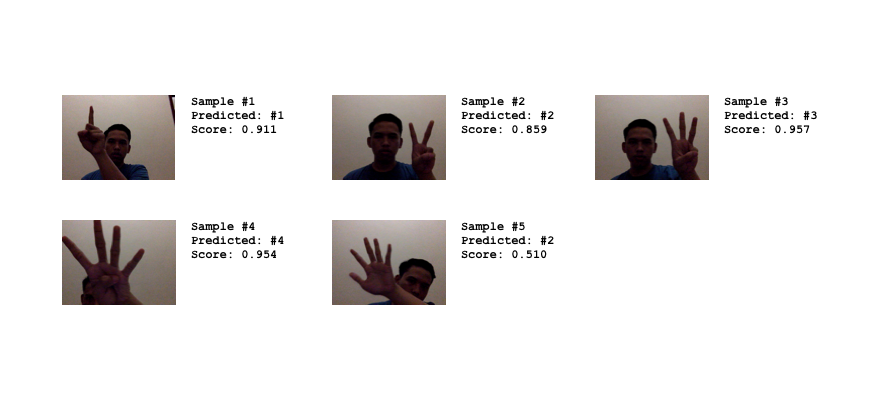

# HSR

This repository contains code that I use to build a machine learning model for hand signals 
recognition system.

The training data is not included. You can create your own training data 
using webcam via Chrome. I use the following 
[HTML & JS script](https://gist.github.com/pyk/48b92225d1e3c5a732d1fda7c7b79ce5) 
to collect the training data.

## Running

    python train.py training-data/

It expect all images inside `training-data` directory are named using this 
format: `label_id-*` where `label_id` is natural number and `0 < label_id`.

